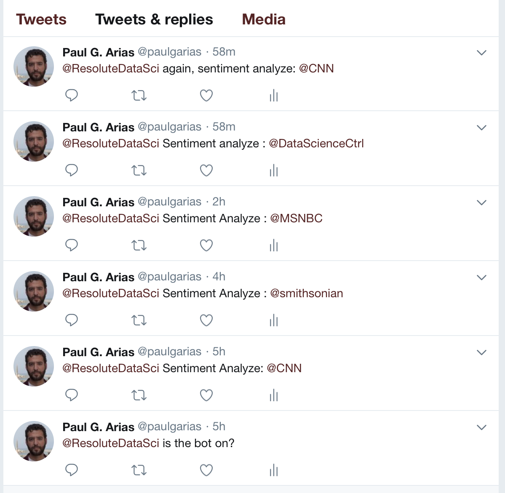
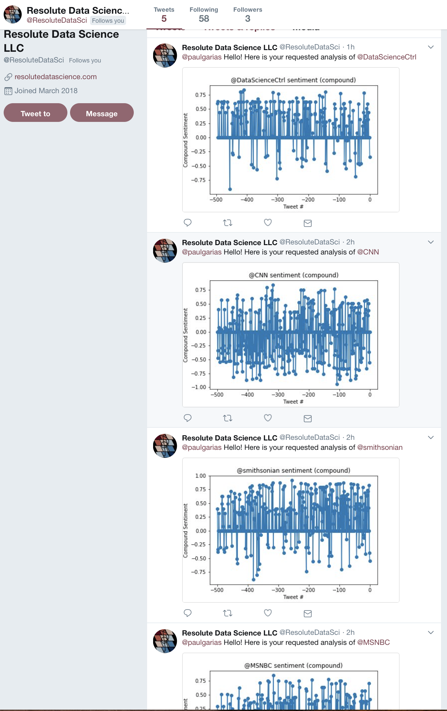

# Distinguising Sentiments - HW 7 - PlotBot

## Paul G. Arias, Ph.D.

[Resolute Data Science LLC account as PlotBot](https://twitter.com/ResoluteDataSci/with_replies)

I used my LLC's account in order to create a bot for this assignment. This allowed me to use my personal account to request analysis.  
  
The PlotBot is able to provide you with sentiment analys using VADER. You can see use the following method to get an analysis:
  
@ResoluteDataSci sentiment analyze : @twitter_screen_name
  
Where you can replace @twitter_screen_name with the handle that you want a sentiment analysis for.
  
Example command:  
  
@ResoluteDataSci sentiment analyze : @facebook  
  
Below are pictures of some alreay produced cases.  
  

 
  
  
 
